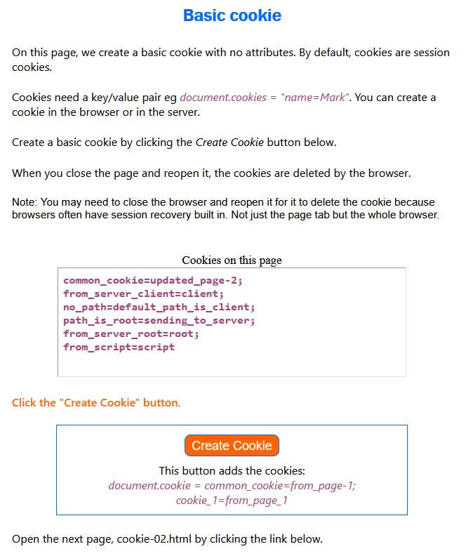

# Cookies Guide

This is an interactive <i>Cookies Guide</i> that helps you understand how cookies work. As you go through this <i>Cookies Guide</i>, there are buttons you can click that tell you the cookie it creates and you can see the cookie being added in the brower by looking at the console <i>Network</i> tab. There is an Express server file that runs in the background to help with this interactive guide.

### To get started
1. Clone this repo.
2. Run the Express server file by typing in <i>npm run server</i> in a console.
3. If you use a web server within VS Code, it's already configured to port 25051, if instead, you use a different web server, please use port 25051.

  

A screenshot sample:

